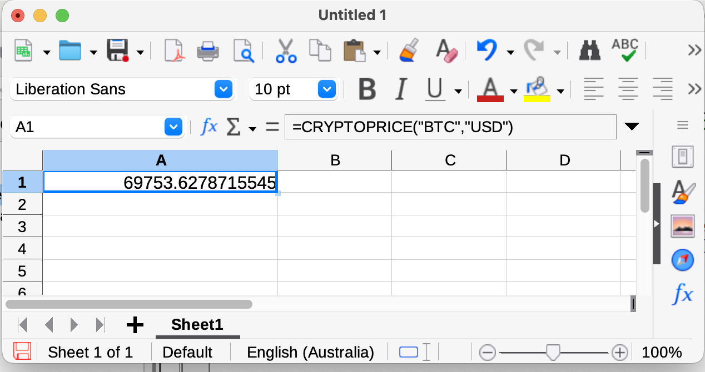

# Libreoffice calc Coinmarketcap Price Fetch Macro

## Usage

    =CRYPTOPRICE("BTC", "USD")

Will fetch the latest BTC price in USD from Coinmarketcap's API.  

> Note you will need to provide your own coinmarketcap api key (this can
> be obtained for free)

## Installation Instructions
It's a little complicated to setup as this macro uses python as well as basic.  

1. Enable Medium Security Macro settings

    Preferences -> Libreoffice -> Security -> Macro Security`
	
2. Modify the file CMCPriceGet.py to include your CMC API key then copy the file to your Libreoffice Scripts folder
On Mac this folder is  
  

    ~/Library/Application Support/LibreOffice/4/user/Scripts/python/

3. Then in the spreadsheet of your choice, open the macro editor (Tools -> Macros -> Edit Macros)
And copy paste the content of macro.bas into there.

Now you should be able to use the command 
**=CRYPTOPRICE(CryptoCurrencyCode, CurrencyCode)**

## Copyright
(C) Michael Johnston 2024
Released without warranty under MIT License

